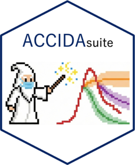

<!-- README.md is generated from README.Rmd. Please edit that file -->

```{r, include = FALSE}
knitr::opts_chunk$set(
  collapse = TRUE,
  comment = "#>",
  fig.path = "man/figures/README-",
  out.width = "100%"
)
```

# acciddasuite 

<!-- badges: start -->
<!-- badges: end -->

The goal of acciddasuite is to ...

## Installation

You can install the development version of acciddasuite from [GitHub](https://github.com/) with:

```{r}
# install.packages("pak")
#pak::pak("ACCIDDA/acciddasuite")
```

## Example
```{r, eval = FALSE}
#library(acciddasuite)
df <- get_data(pathogen = "flu", geo_values = "ny")
fcast <- df |> 
  get_fcast(eval_start_date = max(df$target_end_date) - 30)
fcast
```

```{r, eval = FALSE}
fcast$plot
```