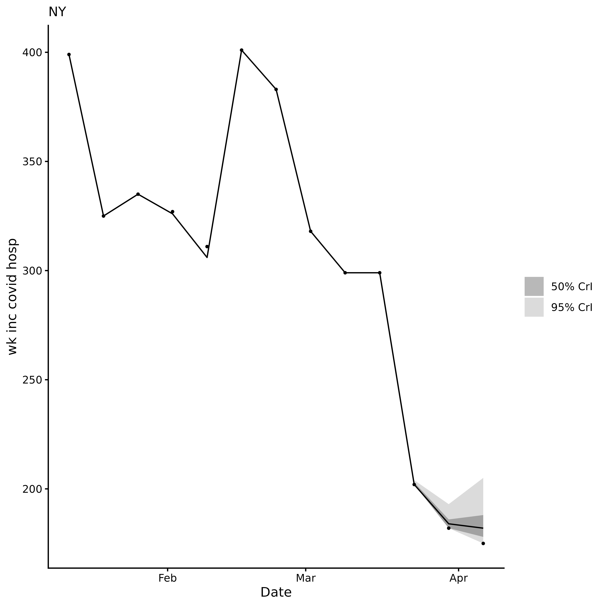
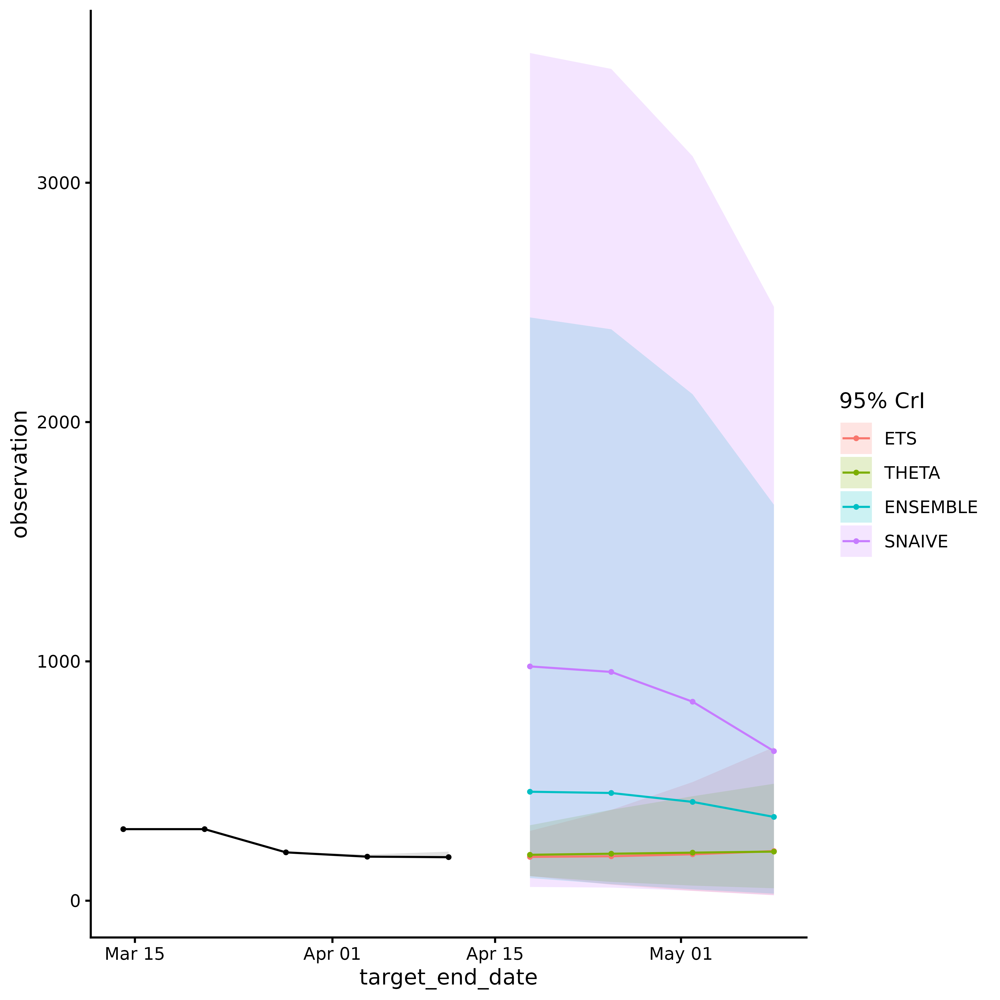

# acciddasuite

## Overview

`acciddasuite` builds infectious disease forecasts in three steps:

1.  **[`get_data()`](https://accidda.github.io/acciddasuite/reference/get_data.md)**
    or
    **[`check_data()`](https://accidda.github.io/acciddasuite/reference/check_data.md)**:
    fetch or validate surveillance data.
2.  **[`get_ncast()`](https://accidda.github.io/acciddasuite/reference/get_ncast.md)**
    *(optional)*: correct recent weeks for reporting delays.
3.  **[`get_fcast()`](https://accidda.github.io/acciddasuite/reference/get_fcast.md)**:
    evaluate models via cross-validation and forecast into the future.

The package relies on the [`fable`](https://fable.tidyverts.org/)
modeling framework and follows the standard forecasting workflow
described by [Hyndman & Athanasopoulos
(2021)](https://otexts.com/fpp3/basic-steps.html). The overall goal is
to provide public health professionals with an easily-adoptable approach
to generating an ensemble of outputs from statistical models, evaluating
forecasts, and visualizing outputs.

## Forecast Planning

**To get more information about how to know whether forecasting is the
best approach for your task, follow the steps in
[this](https://accidda.github.io/acciddasuite/articles/forecast_planning.md)
article.**

## Step 1: Get data

We fetch weekly COVID-19 hospital admissions for New York from the [CDC
NHSN](https://data.cdc.gov/Public-Health-Surveillance/Weekly-Hospital-Respiratory-Data-HRD-Metrics-by-Ju/mpgq-jmmr/about_data)
via [`epidatr`](https://cmu-delphi.github.io/epidatr/).

Setting `revisions = TRUE` retrieves the full revision history (*i.e.*
all past versions of the data), which is needed for nowcasting.

[`get_data()`](https://accidda.github.io/acciddasuite/reference/get_data.md)
returns a validated `accidda_data` object:

``` r
library(acciddasuite)
df <- get_data(pathogen = "covid", geo_value = "ny", revisions = TRUE)
df
#> <accidda_data>
#> 
#> Location: NY 
#> Target:   wk inc covid hosp 
#> Window:   2020-08-08 to 2026-04-11 ( 297 dates )
#> History:  TRUE ( 2024-11-17 to 2026-04-12 )
```

You can also **bring your own data**. Just pass it through
[`check_data()`](https://accidda.github.io/acciddasuite/reference/check_data.md).
See
[`vignette("external_data")`](https://accidda.github.io/acciddasuite/articles/external_data.md)
for formatting details.

## Step 2: Nowcasting (optional)

The most recent weeks of surveillance data are almost always too low
because hospitals are still filing late reports (**right truncated**).
If you feed these raw counts into a forecaster, predictions will be
biased downward.

[`get_ncast()`](https://accidda.github.io/acciddasuite/reference/get_ncast.md)
estimates what the recent counts will look like once all reports arrive.
With the default `max_delay = 4`, the last 4 weeks are corrected;
everything before that is left untouched.

``` r
ncast <- get_ncast(df)
ncast
#> <accidda_ncast>
#> 
#> Nowcasted 4 weeks: 2026-03-21 to 2026-04-11 
#> 
#> $data  corrected series (297 rows)
#> $plot  nowcast visualisation
```

``` r
ncast$plot
```



The corrected `ncast$data` contains two extra columns: `ncast_lower` and
`ncast_upper` (95% CrI) for the corrected weeks.
[`get_fcast()`](https://accidda.github.io/acciddasuite/reference/get_fcast.md)
detects these automatically and uses them to propagate nowcasting
uncertainty into the final forecast.

## Step 3: Forecasting

[`get_fcast()`](https://accidda.github.io/acciddasuite/reference/get_fcast.md)
does two things:

1.  **Model selection**: time series cross-validation on the full
    (median corrected) series, starting from `eval_start_date`. Models
    are ranked by WIS; the best `top_n` form an equal weight ensemble.
2.  **Final forecast**: projects `h` weeks into the future. When nowcast
    columns are present, the forecast is produced from three baselines
    (lower, median, and upper nowcast estimates) and pooled, so
    prediction intervals reflect both model uncertainty and nowcast
    uncertainty.

We set `eval_start_date` to mark the start of the evaluation window. At
least 52 weeks of data must precede this date.

``` r
eval_start_date <- max(ncast$data$target_end_date) - 28
```

Default models are:

- `SNAIVE` (Seasonal Naïve): Assumes this week will look like the same
  week last year. The simplest possible baseline.

- `ETS` (Exponential Smoothing): A weighted average where recent weeks
  matter more than older ones. Adapts to trends and seasonal patterns.

- `THETA`: Splits the data into a long-term trend and short-term
  fluctuations, forecasts each separately, then combines them.

- `ARIMA`: Learns repeating patterns from past values to predict future
  ones. Auto-configured to find the best fit.

We use
[`pipetime::time_pipe()`](https://rdrr.io/pkg/pipetime/man/time_pipe.html)
to log how long the model selection and forecasting steps take.

``` r
fcast <- get_fcast(
  ncast,
  eval_start_date = eval_start_date,
  top_n = 4,
  h = 4
) |> 
  pipetime::time_pipe("base fcast", log = "log")

fcast
#> <accidda_fcast>
#> 
#> Models evaluated:
#>  model_id       wis
#>    <char>     <num>
#>       ETS  30.16633
#>     THETA  41.34537
#>  ENSEMBLE  79.64422
#>    SNAIVE 297.35408
#> 
#> Forecast horizon:
#>   From: 2026-03-14 
#>   To:   2026-05-09 
#> 
#> Contents:
#>   $hubcast   hub forecast object
#>   $score     model ranking table
#>   $plot      ggplot2 object
```

``` r
fcast$plot
```



View forecast evaluation by viewing the `score` element of the object:

``` r
fcast$score
#> Key: <model_id>
#>    model_id       wis interval_coverage_50 interval_coverage_95
#>      <char>     <num>                <num>                <num>
#> 1:      ETS  30.16633                  1.0                    1
#> 2:    THETA  41.34537                  0.5                    1
#> 3: ENSEMBLE  79.64422                  0.5                    1
#> 4:   SNAIVE 297.35408                  0.0                    1
#>    wis_relative_skill
#>                 <num>
#> 1:          0.4091929
#> 2:          0.5608316
#> 3:          1.0803386
#> 4:          4.0334765
```

### Adding custom models

Any model compatible with the [`fable`](https://fable.tidyverts.org/)
framework can be passed via `extra_models`:

``` r
library(fable)
library(fable.prophet)
extra <- list(
  CUSTOM_ARIMA = ARIMA(observation ~ pdq(1,1,0)),
  PROPHET = prophet(observation ~ season("year")),
  EPIESTIM = EPIESTIM(observation, mean_si = 3, std_si = 2, rt_window = 7)
)

fcast <- get_fcast(
  ncast,
  eval_start_date = eval_start_date,
  top_n = 4,
  h = 3,
  extra_models = extra
) |> 
  pipetime::time_pipe("extra fcast", log = "log")
```

You can check how long each step took by calling
[`pipetime::get_log()`](https://rdrr.io/pkg/pipetime/man/get_log.html):

``` r
pipetime::get_log()
#> $log
#>             timestamp       label duration unit
#> 1 2026-04-24 16:51:52  base fcast 18.83492 secs
#> 2 2026-04-24 16:52:15 extra fcast 25.72153 secs
```

## Submit to RespiLens

[RespiLens](https://www.respilens.com/) is a platform for sharing
respiratory disease forecasts. Use
[`to_respilens()`](https://accidda.github.io/acciddasuite/reference/to_respilens.md)
to export the forecast as JSON for upload to
[MyRespiLens](https://www.respilens.com/myrespilens).

``` r
to_respilens(fcast, "respilens.json")
```
