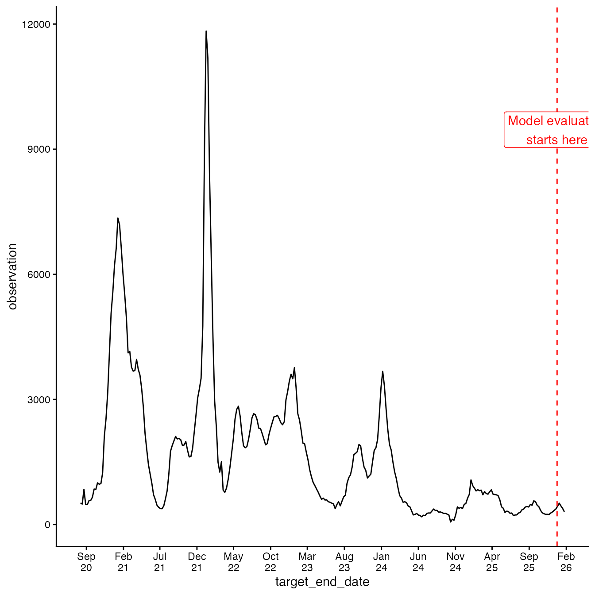
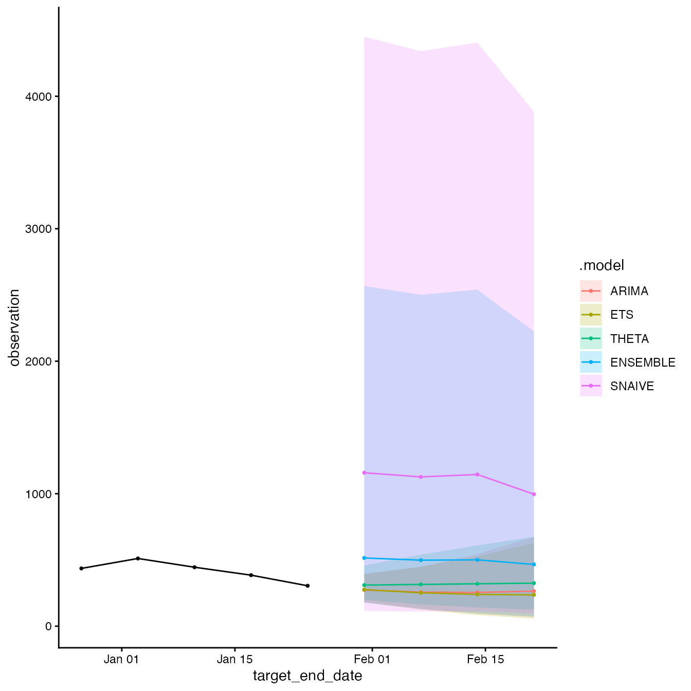

# acciddasuite

## Introduction

The `acciddasuite` package provides comprehensive tools, models, and
information for building infectious disease forecasts using either
national or state-level data. This forecasting suite is focused on using
time series data (surveillance data) for public health use to create an
ensemble of outputs from statistical models, evaluation and
visualization tools.

This series of vignettes demonstrate how the standard frameworks create
and evaluate forecasts using R.

This forecasting suite is initially being set up to run within the Fable
framework, a tidyverse-based alternative for time series forecasting in
R.

We will aim to demonstrate the basic steps in a forecasting task, as
defined by [Hyndman & Athanasopoulos
(2021)](https://otexts.com/fpp3/basic-steps.html). Updated forecasting
package information can be found
[here](https://robjhyndman.com/hyndsight/forecast9.html).

## Statistical Modelling

### `get_data`

**Ideally, you would load your own data here**.

For demonstration purposes, we will load data from the [CDC National
Health Safety
Network](https://data.cdc.gov/Public-Health-Surveillance/Weekly-Hospital-Respiratory-Data-HRD-Metrics-by-Ju/mpgq-jmmr/about_data).
The data dictionary is available
[here](https://dev.socrata.com/foundry/data.cdc.gov/mpgq-jmmr).

``` r
library(dplyr)
library(ggplot2)
library(pipetime)
library(acciddasuite)
df <- get_data(pathogen = "covid", geo_values = "ny")
summary(df)
#>      as_of              location            target         
#>  Min.   :2026-01-25   Length:286         Length:286        
#>  1st Qu.:2026-01-25   Class :character   Class :character  
#>  Median :2026-01-25   Mode  :character   Mode  :character  
#>  Mean   :2026-01-25                                        
#>  3rd Qu.:2026-01-25                                        
#>  Max.   :2026-01-25                                        
#>  target_end_date       observation     
#>  Min.   :2020-08-08   Min.   :   60.0  
#>  1st Qu.:2021-12-19   1st Qu.:  461.2  
#>  Median :2023-05-02   Median :  995.0  
#>  Mean   :2023-05-02   Mean   : 1644.0  
#>  3rd Qu.:2024-09-12   3rd Qu.: 2241.8  
#>  Max.   :2026-01-24   Max.   :11833.0
```

### Time Series Cross-Validation

To evaluate predictive performance, we employ *time series
cross-validation*. We fit models using the data available up to a
specific cutoff point (`eval_start_date`), then forecast `h` weeks ahead
with expanding windows. You do not want to `eval_start_date` to be too
far back in time as it can be computationally expensive.

We visualise the data and decide on the `eval_start_date`.

``` r
# We ony evaluate on the last 30 days of data for demonstration purposes
eval_start_date <- max(df$target_end_date) - 30

df |>
  ggplot(aes(x = target_end_date, y = observation)) +
  geom_line() +
  geom_vline(
    xintercept = eval_start_date,
    linetype = "dashed",
    color = "red"
  ) +
  annotate(
    "label",
    x = eval_start_date,
    y = max(df$observation) * 0.8,
    label = "Model evaluation\nstarts here",
    color = "red"
  ) +
  scale_x_date(date_labels = "%b\n%y", breaks = "5 months") +
  theme_classic()
```



Default models are:  **Naïve (Random Walk RW)**: A baseline model
carrying forward the last observation.  
**ETS**: Exponential Smoothing state space model (automatically
selected). **ARIMA**: Auto-Regressive Integrated Moving Average model
(automatically selected).

``` r
fcast = get_fcast(
  df,
  eval_start_date = eval_start_date,
  top_n = 4, # Select top 4 models
  h = 4 # forecast 4 weeks ahead
) |>
  time_pipe("forecasting")
#> Time Series Cross Validation...
#> Forecast Generation...

fcast
#> <accida_cast>
#> 
#> Models evaluated:
#>  model_id       wis
#>    <char>     <num>
#>     ARIMA  39.46377
#>       ETS  39.50977
#>     THETA  43.41059
#>  ENSEMBLE  63.82600
#>    SNAIVE 272.68963
#> 
#> Forecast horizon:
#>   From: 2025-12-27 
#>   To:   2026-02-21 
#> 
#> Contents:
#>   $hubcast   hub forecast object
#>   $score     model ranking table
#>   $plot      ggplot2 object
fcast$plot
```



``` r
fcast$hubcast
#> $model_out_tbl
#> # A tibble: 200 × 9
#>    model_id reference_date target   horizon location target_end_date output_type
#>    <chr>    <date>         <chr>      <int> <chr>    <date>          <chr>      
#>  1 ARIMA    2025-12-20     wk inc …       1 NY       2025-12-27      quantile   
#>  2 ARIMA    2025-12-20     wk inc …       1 NY       2025-12-27      quantile   
#>  3 ARIMA    2025-12-20     wk inc …       1 NY       2025-12-27      quantile   
#>  4 ARIMA    2025-12-20     wk inc …       1 NY       2025-12-27      quantile   
#>  5 ARIMA    2025-12-20     wk inc …       1 NY       2025-12-27      quantile   
#>  6 ARIMA    2025-12-20     wk inc …       2 NY       2026-01-03      quantile   
#>  7 ARIMA    2025-12-20     wk inc …       2 NY       2026-01-03      quantile   
#>  8 ARIMA    2025-12-20     wk inc …       2 NY       2026-01-03      quantile   
#>  9 ARIMA    2025-12-20     wk inc …       2 NY       2026-01-03      quantile   
#> 10 ARIMA    2025-12-20     wk inc …       2 NY       2026-01-03      quantile   
#> # ℹ 190 more rows
#> # ℹ 2 more variables: output_type_id <chr>, value <dbl>
#> 
#> $oracle_output
#> # A tibble: 286 × 6
#>    location target_end_date target       output_type output_type_id oracle_value
#>    <chr>    <date>          <chr>        <chr>       <lgl>                 <dbl>
#>  1 NY       2020-08-08      wk inc covi… quantile    NA                      517
#>  2 NY       2020-08-15      wk inc covi… quantile    NA                      490
#>  3 NY       2020-08-22      wk inc covi… quantile    NA                      844
#>  4 NY       2020-08-29      wk inc covi… quantile    NA                      483
#>  5 NY       2020-09-05      wk inc covi… quantile    NA                      479
#>  6 NY       2020-09-12      wk inc covi… quantile    NA                      573
#>  7 NY       2020-09-19      wk inc covi… quantile    NA                      578
#>  8 NY       2020-09-26      wk inc covi… quantile    NA                      656
#>  9 NY       2020-10-03      wk inc covi… quantile    NA                      851
#> 10 NY       2020-10-10      wk inc covi… quantile    NA                      840
#> # ℹ 276 more rows
fcast$score
#> Key: <model_id>
#>    model_id       wis interval_coverage_50 interval_coverage_95
#>      <char>     <num>                <num>                <num>
#> 1:    ARIMA  39.46377                 0.75                    1
#> 2:      ETS  39.50977                 1.00                    1
#> 3:    THETA  43.41059                 0.50                    1
#> 4: ENSEMBLE  63.82600                 1.00                    1
#> 5:   SNAIVE 272.68963                 0.25                    1
#>    wis_relative_skill
#>                 <num>
#> 1:          0.6052929
#> 2:          0.6059985
#> 3:          0.6658289
#> 4:          0.9789593
#> 5:          4.1824967
```

### Adding `extra_models`

Additonal models can be added to the forecasting suite by defining them
in a list and passing them to
[`get_fcast()`](https://accidda.github.io/acciddasuite/reference/get_fcast.md).
The models should be compatible with the fable framework (see [fable
documentation](https://fabletools.tidyverts.org/articles/extension_models.html)
for more information).

``` r
library(fable)
library(fable.prophet)
extra <- list(
  CUSTOM_ARIMA = ARIMA(observation ~ pdq(1,1,0)),
  PROPHET = prophet(observation ~ season("year")),
  EPIESTIM = EPIESTIM(observation, mean_si = 3, std_si = 2, rt_window = 7)
)

fcast = get_fcast(
  df,
  eval_start_date = eval_start_date,
  top_n = 4, # Select top 4 models
  h = 3, # forecast 3 weeks ahead,
  extra_models = extra
) |>
  time_pipe("forecasting")
#> Time Series Cross Validation...
#> Forecast Generation...

fcast
#> <accida_cast>
#> 
#> Models evaluated:
#>      model_id        wis
#>        <char>      <num>
#>      EPIESTIM   30.78158
#>           ETS   32.52275
#>      ENSEMBLE   35.58608
#>         ARIMA   37.37021
#>         THETA   47.36624
#>  CUSTOM_ARIMA  126.93577
#>        SNAIVE  268.02628
#>       PROPHET 1664.29545
#> 
#> Forecast horizon:
#>   From: 2025-12-27 
#>   To:   2026-02-14 
#> 
#> Contents:
#>   $hubcast   hub forecast object
#>   $score     model ranking table
#>   $plot      ggplot2 object
```

## Submit to MyRespiLens

[RespiLens](https://www.respilens.com/) is a platform for sharing and
visualizing respiratory disease forecasts. To submit forecasts to
RespiLens, you can use the `to_respilens()` with
[`jsonlite::write_json()`](https://jeroen.r-universe.dev/jsonlite/reference/read_json.html)
to save a JSON file in the required format. You can then upload this
file to MyRespiLens [here](https://www.respilens.com/myrespilens).

``` r
library(jsonlite)
to_respilens(fcast) |>
  jsonlite::write_json("respilens.json", pretty = TRUE, auto_unbox = TRUE)
```
