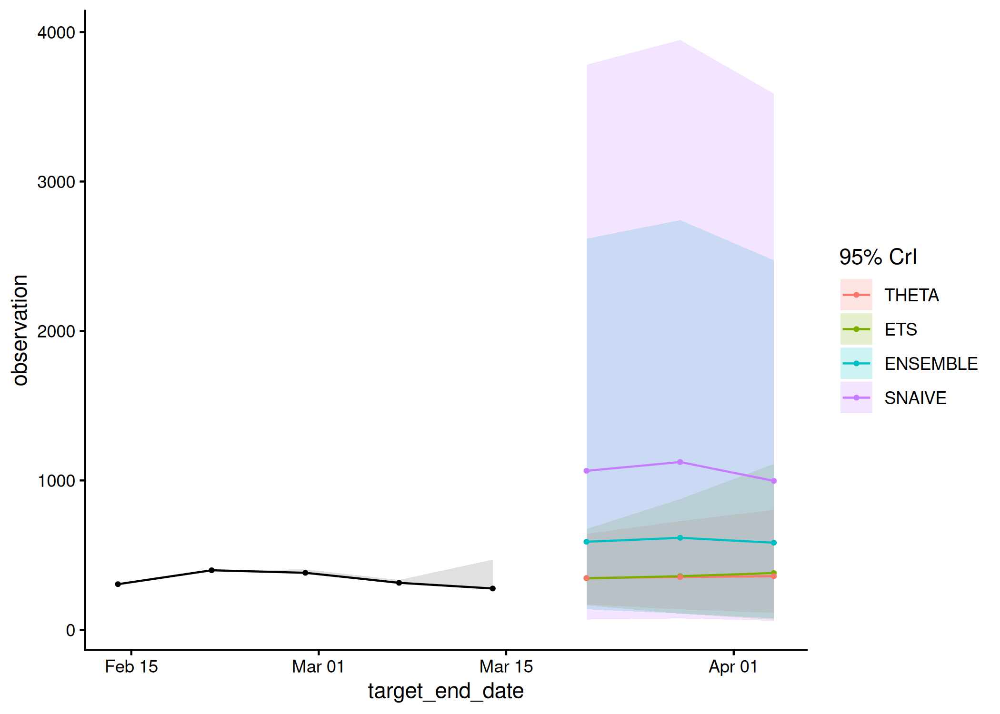

# acciddasuite

[](https://github.com/ACCIDDA/acciddasuite/actions/workflows/r.yml)
[](https://app.codecov.io/gh/ACCIDDA/acciddasuite)
[](https://CRAN.R-project.org/package=acciddasuite)

`acciddasuite` provides a simple pipeline for infectious diseases
forecasts. It validates input data
([`check_data()`](https://accidda.github.io/acciddasuite/reference/check_data.md)),
optionally applies nowcasting to adjust for reporting delays
([`get_ncast()`](https://accidda.github.io/acciddasuite/reference/get_ncast.md)),
and generates forecasts
([`get_fcast()`](https://accidda.github.io/acciddasuite/reference/get_fcast.md)).

## Installation

You can install the development version of acciddasuite from
[GitHub](https://github.com/) with:

``` r
# install.packages("pak")
#pak::pak("ACCIDDA/acciddasuite")
```

## Example

``` r
library(acciddasuite)
head(example_data)
#> # A tibble: 6 × 5
#>   as_of      location target            target_end_date observation
#>   <date>     <chr>    <chr>             <date>                <dbl>
#> 1 2024-11-17 NY       wk inc covid hosp 2020-08-08              517
#> 2 2024-11-24 NY       wk inc covid hosp 2020-08-08              517
#> 3 2024-12-01 NY       wk inc covid hosp 2020-08-08              517
#> 4 2024-12-08 NY       wk inc covid hosp 2020-08-08              517
#> 5 2024-12-15 NY       wk inc covid hosp 2020-08-08              517
#> 6 2024-12-22 NY       wk inc covid hosp 2020-08-08              517
```

``` r
fcast <- example_data |>
  check_data() |> 
  get_ncast() |> 
  get_fcast(
    eval_start_date = max(example_data$target_end_date) - 28,
    h = 3 # forecast 3 weeks into the future
  )
#> ℹ Using max_delay = 12 from data
#> ℹ Truncating from max_delay = 12 to 4.
#> Warning: 1 error encountered for ARIMA
#> [1]
#> ℹ Some rows containing NA values may be removed. This is fine if not
#> unexpected.
#> ℹ Some rows containing NA values may be removed. This is fine if not
#> unexpected.
#> Warning: 1 error encountered for ARIMA
#> [1] 
#> 
#> 1 error encountered for ARIMA
#> [1] 
#> 
#> 1 error encountered for ARIMA
#> [1]
```

``` r
fcast$plot
```



Save to [myRespiLens](https://www.respilens.com/myrespilens) format:

``` r
to_respilens(fcast, path = "respilens.json")
```
